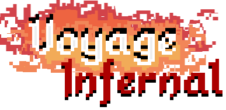
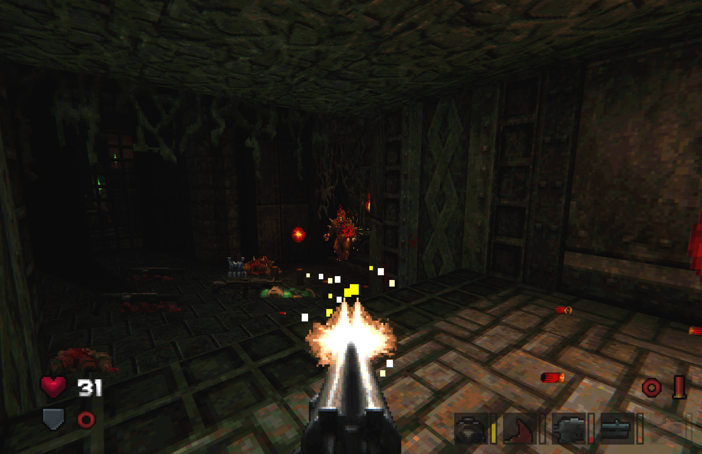
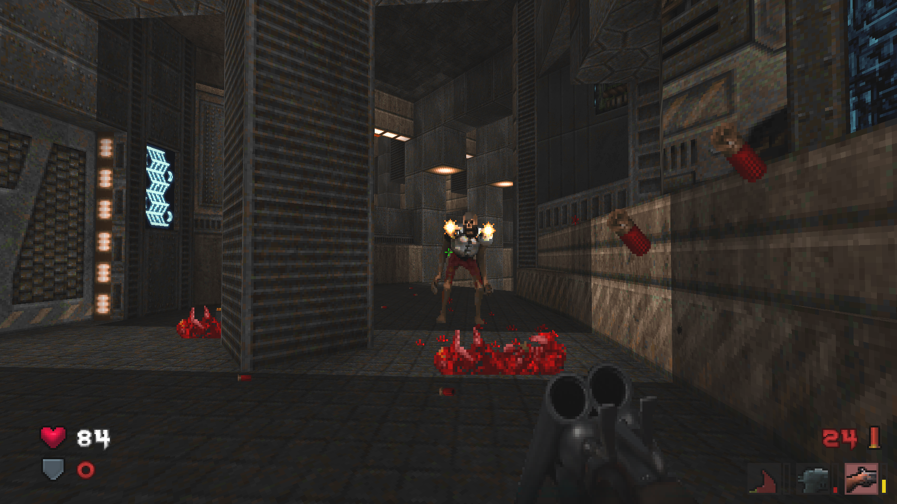

# About

A GZDoom gameplay mod featuring custom weapons, sounds, visual effects, UI and gore system.

Hand-crafted sprite work, curated selection of sfx, emphasis on good feels.

**Note**: There are two hud variants, one with scaled fonts and one with non-scaled. If the scaled variant doesn't look right on your monitor, try changing it to non-scaled in options ( set "Use old HUD" to off ), or play around with hud scaling options

# Credits

Smooth Doom
- some puffs
- some doom64 ssg intermittent reloading sprites
    - pistol hand
- water splashes
- bullet casings
- inspiration ( this whole thing started as a personal edit of smooth doom )

Demonsteele
- sword puffs and decals

High Noon Drifter
- shrapnel sprites

Final Doomer
- some sfx ( backpack, map, radsuit )

Beautiful Doom
- tweaked bullet tracers

BDLite
- floor fire column and smoke

id
- some doom3 sfx, plasmarifle model as reference for plasmarifle

valve + gamebanana community
- some weapon sfx

sketchfab contributors
- lots of reference models for item and weapon sprites

pond5
- some sfx

bethesda
- voice acting

DaZombieKiller + vsonnier
- footsteps module, zscriptified

pfenh
- explosions

naku-naru
- gunsmoke

AeniPuffs
- tweaked bullet puffs

Evilternity
- DBIGFONT for hud

Nash
- epic gibs sprites

tools used: SLADE, Photoshop, Audition